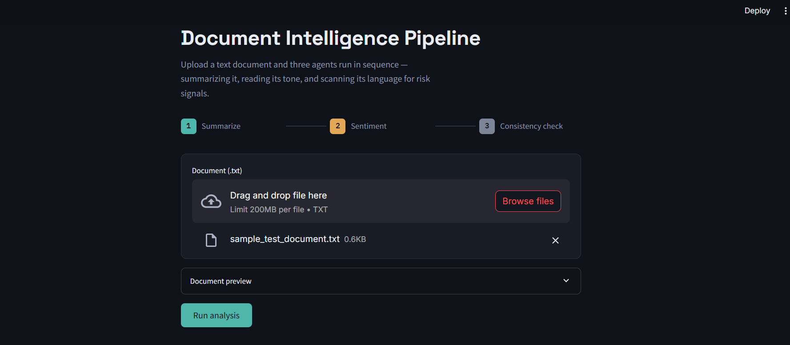
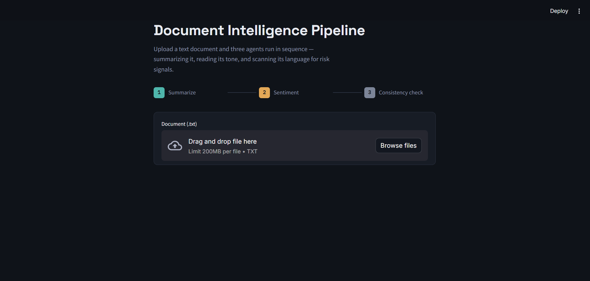
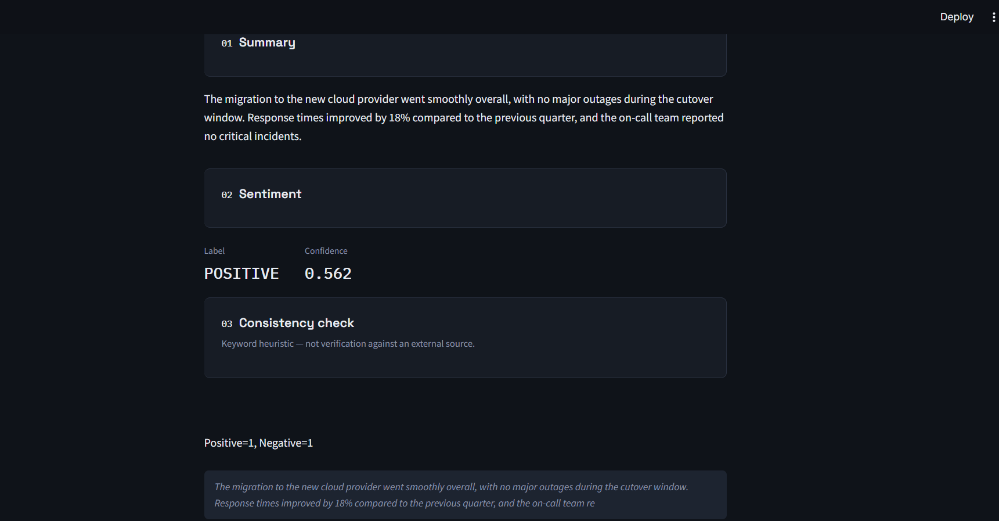

# Multi-Agent Document Intelligence

[](https://www.python.org/)
[](https://streamlit.io/)
[](https://huggingface.co/docs/transformers)
[](#license)
[](https://github.com/Gayathri-Reddy874/multi-agent-document-intelligence/pulls)

A Streamlit app that runs an uploaded text document through three agents in
sequence - a summarizer, a sentiment classifier, and a heuristic consistency
checker - and displays their combined output in a custom-designed UI.

---

## Screenshots

**Upload a document**


**Preview before analysis**


**Analysis results**


## Architecture

```
                ┌───────────────┐
   .txt file →  │  Streamlit UI │
                │   (app.py)    │
                └───────┬───────┘
                        │
                ┌───────▼───────┐
                │  Coordinator  │  runs each agent, isolates failures
                └───────┬───────┘
          ┌─────────────┼─────────────────┐
          ▼             ▼                 ▼
  SummarizerAgent  SentimentAgent   FactCheckerAgent
  (BART-large-CNN) (RoBERTa/Cardiff) (keyword heuristic,
                                      consumes the summary
                                      as extra context)
```

Every agent implements the same `BaseAgent.process(text, context)` interface,
so adding a new agent means writing one class and registering it in
`Coordinator` - the UI doesn't need to change.

## Features

- **Summarization** - abstractive summary via `facebook/bart-large-cnn`.
- **Sentiment analysis** - 3-class sentiment via
  `cardiffnlp/twitter-roberta-base-sentiment-latest`.
- **Consistency check** - a transparent, deterministic keyword scorer that
  flags whether a document leans toward positive/operational language or
  risk-indicating language (latency, problems, etc.). This is **not** fact
  verification against an external source - see the note in
  `agents/fact_checker.py`.
- **Fault isolation** - if one agent fails (e.g. a model can't load), the
  others still return results instead of crashing the whole request.
- **Configurable** - model names and length limits live in `config.py` and
  can be overridden via environment variables.
- **Custom UI** - a dark, ink-navy interface with a numbered pipeline strip
  (the analysis genuinely runs summarize → sentiment → consistency check in
  that order) and bespoke result panels, rather than Streamlit's default
  theme and alert boxes.

## Project structure

```
multi-agent-document-intelligence/
├── agents/
│   ├── __init__.py
│   ├── base_agent.py      # abstract interface
│   ├── summarizer.py
│   ├── sentiment.py
│   └── fact_checker.py
├── tests/
│   └── test_agents.py     # fast, dependency-light unit tests
├── app.py                 # Streamlit UI
├── coordinator.py         # orchestration + error isolation
├── config.py              # models, thresholds, env overrides
├── requirements.txt
├── Dockerfile
└── .gitignore
```

## Setup

```bash
git clone https://github.com/Gayathri-Reddy874/multi-agent-document-intelligence.git
cd multi-agent-document-intelligence

python -m venv .venv
source .venv/bin/activate        # Windows: .venv\Scripts\activate
pip install -r requirements.txt
```

## Run

```bash
streamlit run app.py
```

Then open the local URL Streamlit prints (usually `http://localhost:8501`),
upload a `.txt` file, and click **Run analysis**.

## Run with Docker

```bash
docker build -t multi-agent-document-intelligence .
docker run -p 8501:8501 multi-agent-document-intelligence
```

## Run tests

```bash
pytest tests/ -v
```

The test suite only covers `FactCheckerAgent`, since it's pure logic.
`SummarizerAgent` and `SentimentAgent` load multi-hundred-MB pretrained
models, so they're better suited to a separate integration-test job (e.g.
run nightly in CI, not on every commit) rather than the fast unit suite.

## Known limitations

- The "fact checker" is a keyword heuristic, not real fact verification -
  named for pipeline continuity, documented honestly in code and here.
- No persistence: each analysis run is stateless and in-memory.
- No authentication/rate-limiting - fine for a local demo, not for a public
  deployment as-is.
- Model downloads happen on first use (`@st.cache_resource` avoids
  re-downloading within a session, but the first request will be slow).

## Possible next steps

- Add CI (GitHub Actions) running `pytest` + linting on every push.
- Swap the keyword-based checker for an LLM-based claim extractor if real
  fact-checking is actually needed.
- Add a `requirements-dev.txt` separating runtime vs. test/lint dependencies.
- Add structured logging/observability if this moves beyond a demo.

## License

MIT - see `LICENSE` (add one if you plan to open-source this).

## Author

**Mallareddygari Gayathri**

AI/ML Engineering graduate, based in Bengaluru, India.

- GitHub: [@Gayathri-Reddy874](https://github.com/Gayathri-Reddy874)
